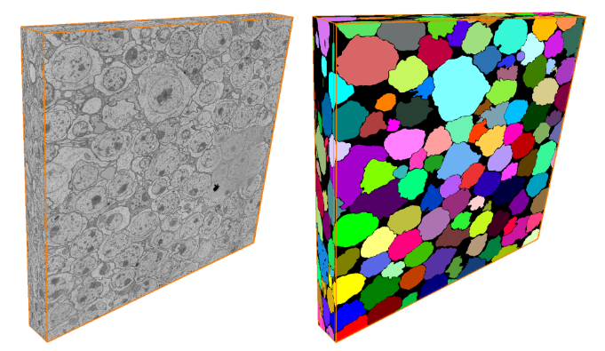
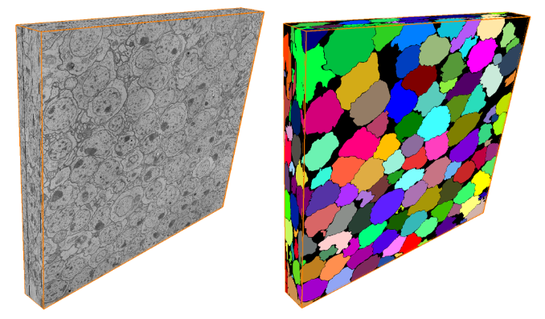
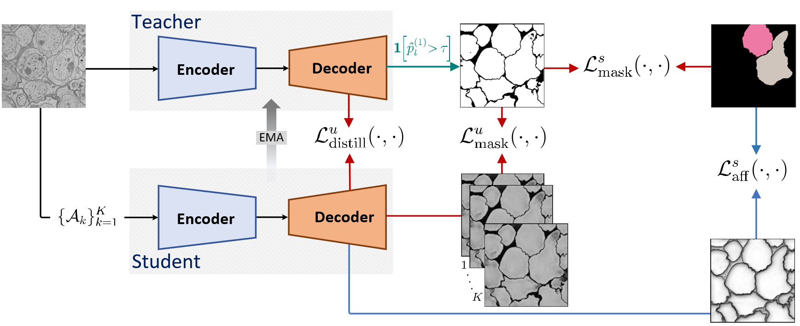
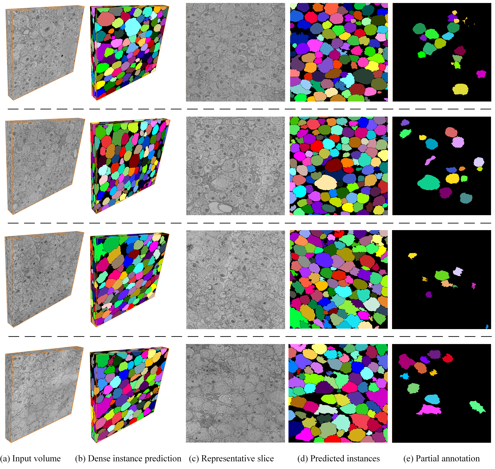

# SomaNet

### SomaNet: Weakly Supervised Learning for Instance Soma Segmentation in 3D Electron Microscopy with Partial Annotations

**Mohammad Khateri, Morteza Ghahremani, Jussi Tohka, Alejandra Sierra**

Instance segmentation of somata in 3D EM volumes. Two model variants:

- **SomaNet_DINOv2/**  — DINOv2 backbone
- **SomaNet_SwinIR/**  — SwinIR backbone

<p align="center">
  
  
</p>
<p align="center"><em>Raw EM block and SomaNet's predicted soma instances.</em></p>

## Method

Each variant uses a teacher–student framework that learns dense soma instances from partial annotations.

<p align="center"></p>

## Layout

How the repository is organized:

```
SomaNet/
├── SomaNet_DINOv2/     # run_infer.py, run_eval.py, stage1/, stage2/
├── SomaNet_SwinIR/     # run_infer.py, run_eval.py, stage1/, stage2/
├── data/               # the data root (SOMANET_DATA): train_sets/ + test_sets/
├── preprocessing/      # nii.gz -> per-slice PNGs (+ dataset download helper)
└── environment.yml     # conda env
```

## 1. Install

Create and activate the conda environment (all dependencies are pinned):

```bash
conda env create -f environment.yml
conda activate somanet
```

## 2. Data

Put the volumes under `data/` and build the training PNGs — see
[`preprocessing/README.md`](preprocessing/README.md) and
[`data/README.md`](data/README.md). Both models read this shared `data/` by
default; override with `export SOMANET_DATA=/path/to/data_root`.

## 3. Inference & evaluation

**DINOv2**

```bash
cd SomaNet_DINOv2
bash somanet_dinov2_stage2/download_weights.sh   # fetch the trained checkpoint
python -u run_infer.py 01         # -> stage2/inference_results/.../pred_FINAL.nii.gz
python -u run_eval.py  01         # -> 7 metrics, saved next to the prediction
```

> The DINOv2 backbone is fetched once via `torch.hub` on first run (needs internet).
> On an offline compute node, pre‑cache it and set `TORCH_HOME` beforehand — see
> [`SomaNet_DINOv2/README.md`](SomaNet_DINOv2/README.md) for the one‑liner.

**SwinIR**

```bash
cd SomaNet_SwinIR
bash somanet_swinir_stage2/download_weights.sh   # fetch the trained checkpoint
python -u run_infer.py 01         # -> stage2/inference_results/.../pred_FINAL.nii.gz
python -u run_eval.py  01         # -> 7 metrics, saved next to the prediction
```

`run_infer.py <vol>` runs `data/test_sets/<vol>` by default; set
`SOMANET_SPLIT=train_sets` to run a training volume instead.

## 4. Training

Train from scratch — stage 1 (pretraining), then stage 2 (teacher–student).

**DINOv2**

```bash
cd SomaNet_DINOv2/somanet_dinov2_stage1 && python -u run_trainer.py   # stage 1
cd ../somanet_dinov2_stage2             && python -u run_trainer.py   # stage 2
```

**SwinIR**

```bash
cd SomaNet_SwinIR/somanet_swinir_stage1 && python -u run_trainer.py   # stage 1
cd ../somanet_swinir_stage2             && python -u run_trainer.py   # stage 2
```

On a cluster, submit the `bash_*.slurm` scripts in each stage folder instead.

<p align="center"></p>


## Citation

If you find SomaNet useful, please ⭐ the repository and cite our paper:

```bibtex
@article{khateri2026somanet,
  title={SomaNet: Weakly Supervised Learning for Instance Soma Segmentation in 3D Electron Microscopy with Partial Annotations},
  author={Khateri, Mohammad and Ghahremani, Morteza and Tohka, Jussi and Sierra, Alejandra},
  journal={arXiv preprint arXiv:2609.23019},
  year={2026}
}
```

## License

Released under the [MIT License](LICENSE).

